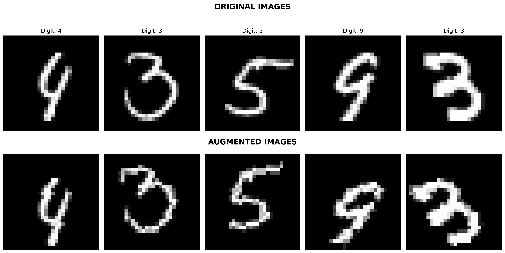

# MNIST Classification with CI/CD Pipeline


## Introduction
A Convolutional Neural Network (CNN) based MNIST digit classifier implementing automated testing pipeline and data augmentation techniques. The project demonstrates CI/CD practices in machine learning, ensuring model quality through comprehensive testing.

## Requirements
- Python 3.10+ (recommended)
- PyTorch and torchvision (CPU version)
- pytest (for testing)
- matplotlib (for visualization)
- numpy
- pillow (for image processing)
- psutil (for resource monitoring)

## Project Structure
```
.
├── src/
│   ├── model.py              # CNN architecture
│   ├── train.py              # Training with augmentation
│   ├── test_model.py         # Validation tests
│   └── show_augmentations.py # Augmentation visualization
├── .github/workflows/        # CI/CD configuration
└── requirements.txt          # Dependencies
```

## Model Architecture
- Input Layer: 28x28 grayscale images
- Convolutional Layers:
  * Conv1: 6 filters, 3x3 kernel, ReLU, MaxPool
  * Conv2: 12 filters, 3x3 kernel, ReLU, MaxPool
- Fully Connected Layers:
  * FC1: 588 → 24 units, ReLU
  * FC2: 24 → 10 units (output)
- Total Parameters: < 25,000

## Training Details
- Dataset: MNIST
- Batch Size: 64
- Optimizer: Adam (lr=0.001)
- Loss Function: Cross Entropy Loss
- Epochs: 1
- Training Augmentation:
  * Real-time data augmentation during training
  * Random augmentations applied to each batch
  * Validation performed on non-augmented test data

## Features
### Data Augmentation
Training employs three mild augmentations:
- Random rotation (±15 degrees)
- Random shift (±10%)
- Random scale (±10%)

Augmentation samples showcasing how the training images are transformed:


## Validation Tests
### Basic Tests
- Parameter count verification (< 25,000)
- Input/Output shape validation
- Overall accuracy > 95%

### Advanced Tests
1. Noise Robustness
   - Adds 10% Gaussian noise
   - Validates prediction stability
2. Gradient Health
   - Checks for vanishing/exploding gradients
   - Ensures proper gradient flow
3. Class-wise Accuracy
   - Ensures >90% accuracy per digit
   - Validates balanced performance
4. Prediction Confidence
   - Verifies high confidence for correct predictions
   - Checks uncertainty for incorrect ones

## Setup and Running Locally
1. Create and activate virtual environment:
```bash
python -m venv env
source env/bin/activate  # Windows: env\Scripts\activate
```

2. Install dependencies:
```bash
pip install -r requirements.txt
```

3. Generate augmentation samples:
```bash
python src/show_augmentations.py
```

4. Train model:
```bash
python src/train.py
```

5. Run tests:
```bash
python -m pytest src/test_model.py -v
```

## CI/CD Pipeline
The GitHub Actions workflow automates the following tasks to ensure a streamlined CI/CD process:
1. Sets up Python environment
2. Installs CPU-only dependencies
3. Trains model with augmentation
4. Runs all validation tests
5. Archives trained model

## Model Artifacts
These model files can be reused for inference or further fine-tuning.
Trained models are saved with timestamps:
```
mnist_model_YYYYMMDD_HHMMSS.pth
```
These can be found in the models/ directory after training or in GitHub Actions artifacts.